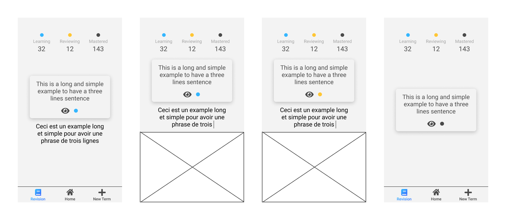

# Reviewer

## Table of content

**_[Description](#description)_**  
**_[Project Structure](#project-structure)_**  
**_[Technologies](#technologies)_**  
**_[Setup](#setup)_**

## Description

This version is an old version with the old name.

This application allows you to write down and review all the words of a foreign language you encounter on a daily basis.

It is mainly composed of 3 tabs.

The **Home screen** showing you the words of the day to review.

The **Revision screen** allowing you to review your words.

The **New Term screen** allowing you to add new words, new sentences.

_Thoses first previews has been made by me with Figma tool._

## Project Structure

Comming soon

## Technologies

**Language**

- JavaScript
- Html
- CSS

**Framework**

- Vue.js
- Sass

## Setup

1. git clone https://github.com/JeremyGillard/reviewer.git
2. yarn install
3. yarn serve
